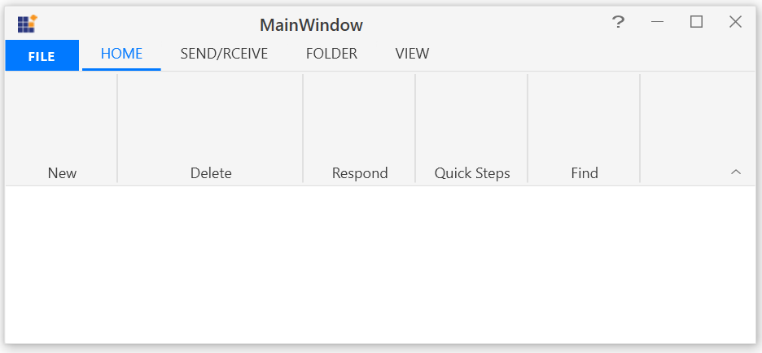
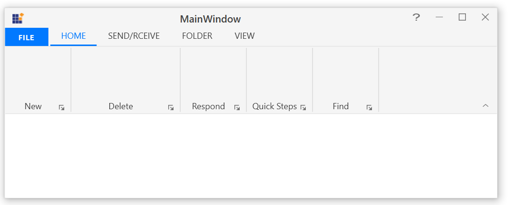

# How-to-change-the-visibility-of-the-LauncherButton-in-WPF-Ribbon-control-
This repository contains the sample that how to change the visibility of the LauncherButton in WPF Ribbon control.

The LauncherButton of RibbonBar can be Hidden or visible by using IsLauncherButtonVisible property  in WPF Ribbon control. The default value of IsLauncherButtonVisible is True. Refer the below code reference.

```XMAL:
<syncfusion:Ribbon x:Name="_ribbon" VerticalAlignment="Top">
<syncfusion:RibbonTab Caption="HOME"  IsChecked="True">
<syncfusion:RibbonBar Name="New" IsLauncherButtonVisible="False"  Width="90"  Header="New"/>
<syncfusion:RibbonBar Name="Delete"  Width="150" IsLauncherButtonVisible="False" Header="Delete"/>
<syncfusion:RibbonBar Name="Respond" Width="90" IsLauncherButtonVisible="False" Header="Respond"/>
<syncfusion:RibbonBar Name="Quicksteps" Width="90" IsLauncherButtonVisible="False" Header="Quick Steps"/>
<syncfusion:RibbonBar Name="Find" Width="90" IsLauncherButtonVisible="False" Header="Find"/>
</syncfusion:RibbonTab>
<syncfusion:RibbonTab Caption="SEND/RCEIVE"  IsChecked="False"/>
<syncfusion:RibbonTab Caption="FOLDER"  IsChecked="False"/>
<syncfusion:RibbonTab Caption="VIEW"  IsChecked="False"/>
</syncfusion:Ribbon>
```

Output (IsLauncherButtonVisible set as False):

 

Output (IsLauncherButtonVisible set as True):



 
